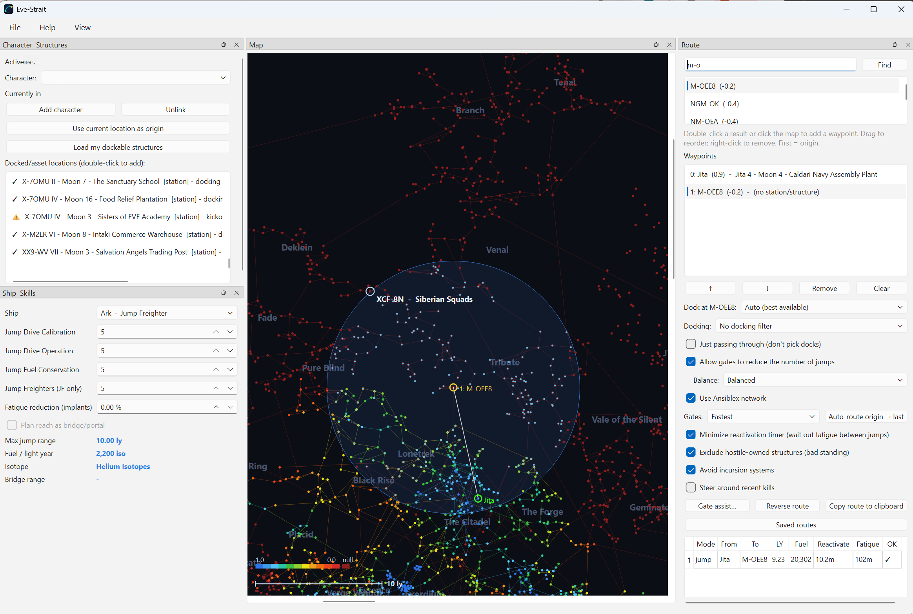

# Eve-Strait

A PySide6 desktop tool for planning **capital / jump‑freighter** routes in EVE Online,
in the spirit of the Dotlan jump map. It shows a pannable, zoomable 2D map of New Eden,
draws your jump range, plans multi‑jump routes, and computes **fuel** and **jump‑fatigue
timing** for each leg. It can authenticate to **ESI** and pull the stations / structures
your character has assets in, to use as staging points, and classify where your hull can
actually dock.



*Planning an Ark jump freighter run out of Jita: the blue circle is the 10 ly reach at
JDC 5, and the route panel shows fuel and the reactivation timer for the leg. Sign in and
the left panel fills with the stations and structures that character can actually dock at.*

## Run

```bash
uv run eve-strait
```

(or `uv run python -m eve_strait`)

The first launch downloads small solar‑system + station coordinate dumps (~a few MB) from
Fuzzwork and caches them locally.

## ESI login (optional)

The map, ranges, fuel and routing all work **without** logging in. Logging in adds your
character's dockable structures, public structure search, contact standings, and
*Set in‑game destination*.

### 1. Create the EVE application

1. Sign in at <https://developers.eveonline.com> → **Manage Applications** →
   **Create New Application**.
2. **Name / Description**: anything (e.g. `Eve-Strait`).
3. **Connection Type**: choose **Authentication & API Access** - *not* "Authentication Only",
   or every scope request fails with `invalid_scope`.
4. **Permissions / Scopes**: tick **all nine** of these now - the app requests them as one
   set at login, so adding them one at a time just means repeating the login:

   - [ ] `publicData`
   - [ ] `esi-assets.read_assets.v1`
   - [ ] `esi-universe.read_structures.v1`
   - [ ] `esi-search.search_structures.v1`
   - [ ] `esi-location.read_location.v1`
   - [ ] `esi-ui.write_waypoint.v1`
   - [ ] `esi-characters.read_contacts.v1`
   - [ ] `esi-corporations.read_contacts.v1`
   - [ ] `esi-alliances.read_contacts.v1`

5. **Callback URL**: **exactly** this, including the `/callback` path and no trailing space:

   ```
   http://localhost:8635/callback
   ```

6. **Create Application**, then open it and copy the **Client ID**.

### 2. About the secret key

**You do not need the secret key.** This app is a desktop ("native"/public) client and uses
OAuth2 **PKCE**, so only the Client ID is required - no client secret is ever entered, stored
or transmitted. If the developer site shows a **Secret Key**, leave it alone and keep it
private; pasting it into any tool is unnecessary here. (If you ever do leak one, use
**Update Application → refresh the secret** on the dev site.)

### 3. Give the app your Client ID

Either:

- In the app: **File → Set EVE Client ID…** and paste it, or
- set an environment variable before launching:

```bash
EVE_CLIENT_ID=your-client-id-here uv run eve-strait
```

The Client ID and your tokens are stored in `%LOCALAPPDATA%\eve-strait\`
(`config.json` and `token.json`). Delete `token.json`, or use **File → Log out**, to sign out.

### 4. Scopes

**File → Set ESI scopes…** accepts the **JSON array copied straight from the dev site**, or a
space/comma‑separated list. It must match what your application actually grants:

```json
["publicData","esi-assets.read_assets.v1","esi-universe.read_structures.v1","esi-location.read_location.v1","esi-ui.write_waypoint.v1","esi-search.search_structures.v1","esi-characters.read_contacts.v1","esi-corporations.read_contacts.v1","esi-alliances.read_contacts.v1"]
```

| Scope | Used for |
|---|---|
| `publicData` | basic character identity |
| `esi-assets.read_assets.v1` | stations/structures you keep assets in |
| `esi-universe.read_structures.v1` | resolving structure names and owners |
| `esi-search.search_structures.v1` | public player structures in a system |
| `esi-location.read_location.v1` | your current system |
| `esi-ui.write_waypoint.v1` | *Set in‑game destination* |
| `esi-characters/corporations/alliances.read_contacts.v1` | standings used to rank docks |

Then click **Log in with EVE**. A browser opens; after you approve, the app captures the
callback on `localhost:8635` and you can close the tab.

### Troubleshooting

| Error | Fix |
|---|---|
| `invalid_request … redirect URL does not match` | The app's Callback URL isn't exactly `http://localhost:8635/callback`. |
| `invalid_scope` | A requested scope isn't granted - the app is "Authentication Only", or the Client ID belongs to a different application. |
| Login window never returns | Something else is using port 8635, or a firewall blocked the local callback. |
| "No contacts loaded" | The three `read_contacts` scopes are missing; re‑authenticate after adding them. |

Adding scopes later requires **re‑authenticating** (log out, then log in again).

### Caching and rate limits

Eve-Strait caches ESI responses for exactly as long as EVE says they are valid —
about an hour for asset data — and paces its own requests against EVE's published
rate limits. That means pressing **Scan my characters** twice in a row is free the
second time: the panel shows when the data was read and when it next refreshes.
Right-click the button for a forced refresh if you have just refitted, though
EVE's own copy may still be up to an hour behind.

Background work (live location polling, timed intel refreshes) backs off on its
own when the budget runs low, so that anything you actually click still has
allowance left to spend.

## How the numbers work

| Quantity | Formula |
|---|---|
| Max jump range | `base_range_ly × (1 + 0.20 × Jump Drive Calibration)` |
| Fuel / ly | `base_iso × (1 − 0.10·JumpFuelConservation) × (freighter ? 1 − 0.10·JumpFreighters : 1)` |
| Reactivation timer | `max(1 + ly, preFatigue/10)` minutes, capped at 30 |
| New jump fatigue | `max(10·(1+ly), fatigue·(1+ly))` minutes, capped at 5 h (× implant reduction) |

You **can jump out of** high‑sec, but never **into** it (no cyno can be lit in high‑sec), so
jumps only *land* in security **< 0.5**. Capitals additionally cannot use high‑sec gates at
all - only jump freighters (and other subcap hulls) can gate the final high‑sec leg.
Titan bridge range (6 ly) and
Black Ops covert bridge range (8 ly) are shown per hull; tick *Plan reach as bridge* to
draw the reach circle at bridge range.

Ship base ranges / fuel live in [`ships.py`](src/eve_strait/data/ships.py) and are
easy to edit if CCP rebalances. Skills default to **JDC 4 / JDO 5 / JFC 4 / JF 4** and are
adjustable in the *Ship & Skills* panel.

## Docking safety

Where a hull can dock is modelled in
[`docking.py`](src/eve_strait/data/docking.py):

- **Titans / Supercarriers** → Keepstar (XL) only.
- **Carriers / Command Carriers / Dreads / FAX / Rorqual** → NPC stations, Fortizar/Keepstar,
  and XL engineering/refinery structures.
- **Jump Freighters & subcaps** → anything.
- NPC stations are flagged **safe** (docking ring) or **kickout** (unsafe undock).

The route panel offers: *no docking filter*, *require docking for my hull*, and
*prefer safe docking only* (excludes kickout NPC stations).

## Using it

- **Search** a system (double‑click or right‑click → *Add as waypoint*) or **right‑click the
  map** → *Add as waypoint*. Left‑click only pans / selects. First waypoint = origin.
- **Drag** to reorder waypoints; **right‑click** a waypoint (or a map system) for *Show system
  info*, *Show station info* (render image + owner corp/alliance + standing colour), *Set
  in‑game destination*, *Remove*, *Clear all*.
- Adding a system **out of jump range** auto‑inserts bridging hops (runs in the background
  with a spinner).
- **Auto‑route origin → last** builds a full jump+gate route in the background.
- Each waypoint shows its chosen **dock** (station / player structure / "no dock"); change it
  with the dock picker. **Copy route to clipboard** exports `System - Dock` lines.
- The table shows per‑leg mode, LY, fuel, reactivation and fatigue; the footer shows totals.

### Reading the map

- Systems are coloured on the **full in‑game security scale** - a distinct colour for every
  0.1 step, running blue (1.0) → cyan → green → yellow → orange → red (0.0), with deep red for
  null‑sec - so you can read actual security at a glance, not just hi/low/null.
- **Stargate links** are drawn between connected systems using that same scale, keyed to the
  **lower security of the two ends** (the risk of taking that gate). Toggle with
  **View → Show stargate links** (remembered between runs).
- A **colour key** for the security scale sits above the scale bar.
- A **light‑year scale bar** sits at the bottom‑left and rescales as you zoom, so map distance
  can be read directly against your jump range.
- The blue circle is your reach from the selected waypoint; blue dots are systems inside it.

### Sovereignty

Who holds each system is loaded at startup from the public `/sovereignty/map/` endpoint (no
login needed, ~1 s for all 5,383 claimed systems). **Hover** a system on the map to see its
holder, and **right‑click → Show system info** for the full picture - holder name, whether it's
an alliance, corporation or faction, and your **standing** toward them in contact colours. Your
own alliance's space is called out explicitly.

### Ansiblex jump gates

**File → Ansiblex jump gates…** manages the bridge network. **Load from ESI** discovers your
corporation's gates automatically - each gate is auto‑named `A » B` in game, so its name alone
gives the whole link. Gates also get picked up for free while browsing systems you route
through.

Only gates owned by **your corporation or alliance** are adopted, since only the owning
alliance can use them; anything else is ignored. Lines you type by hand are always kept.
Ansiblex legs cost one activation at any distance and burn no ship fuel (the structure pays),
but still apply **jump fatigue and a reactivation timer**. Turn the whole network on or off
with **Use Ansiblex network**.

### Route options

- **Allow gates to reduce the number of jumps** - the main travel switch. With it on, the
  router uses stargates wherever they save jumps: the 116 "regional" gates that span further
  than any ship can jump (e.g. **HB‑5L3 ↔ SF‑XJS at 36 ly**, Cobalt Edge to Tenal - one gate
  hop instead of 24 jumps), and gating out of high‑sec to somewhere you can actually jump from.
  Off = jump drive only.
- **Balance** - how eagerly gates replace jumps, from *Jump whenever possible* through
  **Prefer jumps** (the default) to *Gate whenever possible*. Jump-heavy settings are fast and
  keep you off gates; gate-heavy settings save fuel and fatigue but produce long gate chains.
  A regional gate is taken at **any** setting, because no number of jumps replaces it.

  Carrier, Turnur → SG‑3HY: *Prefer jumps* gives **6 jumps + 1 gate** - jumping to Paala,
  taking the one 14.3 ly gate to LXQ2‑T that has no jump alternative, then jumping in.
  *Prefer gates* on the same route degenerates to 1 jump + 16 gates.
- **Gates**: *Fastest* · *Safer* (prefer high‑sec) · *Less secure* (prefer low/null).
- **Docking filter**: none · require docking · prefer safe (excludes kickout NPC stations).
- **Minimize reactivation timer** - waits out fatigue between jumps so each blue timer stays at
  its floor.
- **Exclude hostile‑owned structures** - drops player structures owned by negative‑standing
  entities (from your contacts).
- **Avoid incursion systems** - routes around systems in an active Incursion.

### Docks

The map opens centred on **Jita**. A waypoint's dock is chosen as: the default you **pinned**
for that system (right‑click a waypoint → *Save current dock as default for this system*, which
persists between runs) → a well‑known preferred station (Jita defaults to **4‑4**, Caldari Navy
Assembly Plant) → otherwise the best‑ranked dock:

1. structures owned by **your corporation**
2. structures owned by **your alliance**
3. structures where you have **configured docking rights** (see below)
4. structures with **positive standing** (character / corp / alliance contacts)
5. **NPC stations** with a docking ring (safe)
6. NPC **kickout** stations
7. neutral / unknown player structures
8. hostile‑owned structures

Within a tier, an owner you are red to sorts below a neutral one.

### Docking rights

**File → Docking rights…** lists corporations and alliances whose structures you may dock at
**regardless of standing**. Rentals, NAPs and access deals are routinely neutral or even red,
so standing alone is the wrong signal for "can I dock here".

Entries rank above a merely positive standing, and are never dropped by *Exclude hostile‑owned
structures*. Names are resolved to IDs through ESI (public, no login needed), and an alliance
entry covers every corporation in it, so you can list the alliance rather than each member
corp. Docks granted this way are labelled *docking rights* in the dock list and station info.

Standings combine your **character, corporation and alliance** contact lists (more specific
wins). A corp‑owned structure also inherits its **alliance's** standing, and structures owned by
your own corp/alliance are recognised as such - you never have a contact entry for yourself.
*Show station info* displays the owning corp, its alliance, and the standing (blue +, red −).
If nothing loads, the status bar names the missing scope.

Ship + skills, the map data, your dockables, and these options are cached between runs.
Public player structures in a route system are pulled via ESI structure search (like the
in‑game search), not just the ones you hold assets in.

## Building and releasing

```bash
powershell -ExecutionPolicy Bypass -File scripts/build_exe.ps1
```

Produces a **program folder** at `dist/Eve-Strait/` plus `dist/Eve-Strait-0.1.0-win64.zip`.
No Python needed to run it. The first build downloads a C compiler and takes several minutes;
the first run downloads map data into `%LOCALAPPDATA%\eve-strait`.

### Why not a single .exe

Nuitka and PyInstaller both build one-file executables by embedding a self-extracting stub
that unpacks to `%TEMP%` and executes from there. That is exactly what a dropper does, so
Microsoft Defender and CrowdStrike flag it, and a small user base means there is no reputation
to offset the heuristic. A plain program folder does not trip it.

This is what [pyfa](https://github.com/pyfa-org/Pyfa) ships too: their Windows build is
PyInstaller **onedir** (`exclude_binaries=True` + `COLLECT`), released as
`pyfa-vX-win.exe` (an Inno Setup installer) alongside `pyfa-vX-win.zip` (the portable folder).
We ship the same two shapes, built with Nuitka.

`-OneFile` still builds the old single exe if you want it for personal use. Expect AV
complaints if you hand it to anyone.

### Installer

`scripts/build_exe.ps1` also produces `dist/Eve-Strait-0.1.0-setup.exe` when
[Inno Setup](https://jrsoftware.org/isinfo.php) is installed (`winget install
JRSoftware.InnoSetup`); the script is [`eve-strait.iss`](dist_assets/win/eve-strait.iss).
It installs per-user by default, so there is no UAC prompt, and leaves
`%LOCALAPPDATA%\eve-strait` alone on uninstall so your settings survive a reinstall.

### Releasing

Push a tag and [the workflow](.github/workflows/release.yml) builds both artifacts on
`windows-latest` and opens a draft release:

```bash
git tag v0.2.0
git push origin v0.2.0
```

### Updating

**Help - Check for updates** asks the GitHub releases API whether a newer tag exists, and can
install it in place. Because the app is a folder rather than a locked single exe, the update is
just a folder swap:

1. the release zip is downloaded into an `update/` subfolder of the install directory;
2. a PowerShell helper is launched **detached** (with `CREATE_BREAKAWAY_FROM_JOB`, or it would
   die with the app) and the app exits;
3. the helper waits for `eve-strait.exe` to become writable again. It polls the **file lock**
   rather than a PID: the lock releasing is the reliable signal that the app is gone;
4. it copies the new build over the old one, prunes files left by previous versions (keeping
   the Inno Setup uninstaller), relaunches, and deletes the staging folder.

Every step is appended to `update-log.txt` next to the executable, so a failed swap is
diagnosable. If the copy fails, or the app never exits, the helper relaunches the existing
build rather than leaving you with nothing. Installs under `Program Files` are detected as
read-only and simply point you at the release page instead.

## Layout

```
src/eve_strait/
  __main__.py         entry point
  config.py           paths, ESI endpoints, constants
  data/ships.py       jump-capable hull data + skills (editable)
  data/docking.py     ship/structure docking rules + NPC station safety
  data/universe.py    SDE loader, light-year geometry, NPC stations
  jump/mechanics.py   range / fuel / fatigue maths
  jump/router.py      route simulation + jump pathfinding
  esi/auth.py         EVE SSO PKCE flow
  esi/client.py       assets → dockable locations
  ui/                 map view + main window
```
